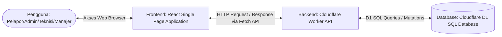

# System Architecture Design: Campus Service Request and Maintenance System

Dokumen ini menjelaskan arsitektur sistem dan integrasi teknologi yang digunakan dalam proyek **Campus Service Request and Maintenance System**.

---

## 1. Teknologi Stack (Technology Stack)
Aplikasi ini dibangun menggunakan arsitektur serverless modern dari Cloudflare:

*   **Frontend**: React (TypeScript) dengan Vite sebagai bundler dan dev server. Menyediakan antarmuka SPA (*Single Page Application*) yang responsif.
*   **Backend (API)**: Cloudflare Workers (TypeScript) yang bertindak sebagai serverless API gateway untuk memproses rute HTTP, validasi, dan otorisasi peran.
*   **Database**: Cloudflare D1, database relasional serverless berbasis SQLite yang dikelola secara terdistribusi oleh Cloudflare.
*   **Integration Tool**: `@cloudflare/vite-plugin` untuk menggabungkan aset statis frontend dan logika backend Worker ke dalam satu paket deployment yang efisien.

---

## 2. Diagram Komponen Sistem (System Component Diagram)

Berikut adalah visualisasi hubungan komponen sistem dan aliran datanya:



### Penjelasan Aliran Data:
1.  Pengguna membuka aplikasi web di browser. Aset statis (HTML, JS, CSS) disajikan langsung oleh Cloudflare Assets.
2.  Setiap interaksi yang membutuhkan data (seperti mengirim laporan baru, memuat daftar tugas, atau memposting komentar) memicu HTTP Request menggunakan **Fetch API** dari Frontend React ke API Backend Worker.
3.  Worker memvalidasi data input, memeriksa peran pengguna, lalu menjalankan kueri SQL relasional menggunakan **D1 Database API**.
4.  D1 memproses data dan mengembalikan hasilnya ke Worker, yang kemudian meresponnya kembali dalam format JSON ke Frontend untuk diperbarui di layar pengguna secara dinamis.

---

## 3. Struktur Folder Proyek (Project Directory Structure)
Berikut adalah struktur tata letak file di dalam repositori proyek:

```
campus-maintenance/
├── .github/workflows/      # Konfigurasi CI/CD GitHub Actions
├── database/migrations/    # File SQL skrip inisialisasi tabel D1
├── docs/                   # Dokumen Rekayasa Kebutuhan & Desain
│   ├── requirements/
│   └── design/
├── src/                    # Kode Sumber Frontend React (TypeScript)
│   ├── components/         # Komponen UI modular
│   ├── App.tsx             # Halaman & state utama aplikasi
│   ├── index.css           # Sistem desain & styling CSS premium
│   └── main.tsx            # Entry point React
├── worker/                 # Kode Sumber Backend Cloudflare Workers
│   └── index.ts            # Logika routing API & interaksi database D1
├── tests/                  # File Pengujian Otomatis (Vitest)
│   ├── unit/
│   └── integration/
├── wrangler.jsonc          # Konfigurasi deployment Cloudflare
├── package.json            # Dependensi proyek & scripts NPM
└── vite.config.ts          # Konfigurasi build Vite & plugin Cloudflare
```
