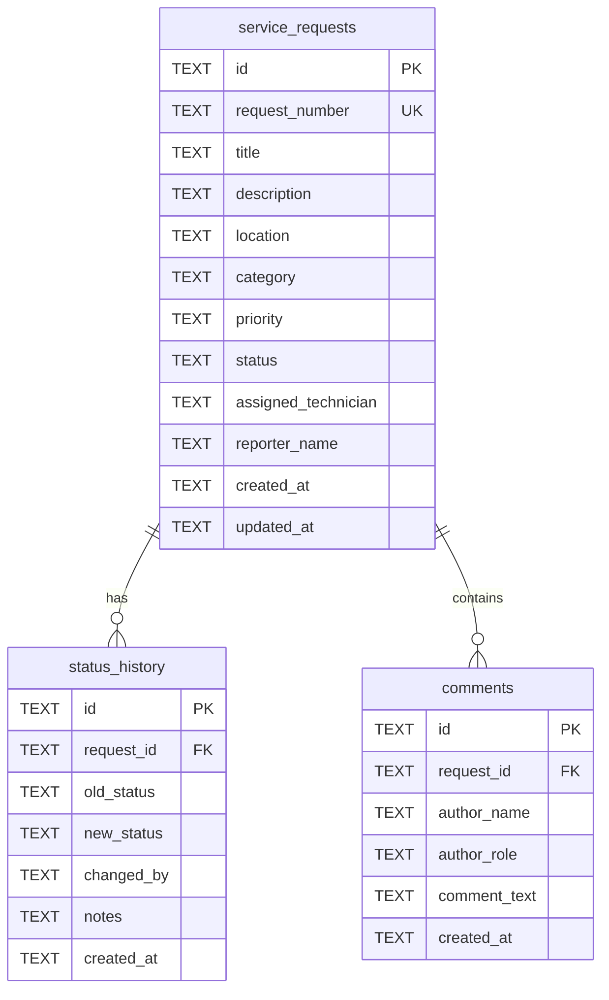

# Database Schema Design: Campus Service Request and Maintenance System

Dokumen ini menjelaskan rancangan skema database relasional menggunakan **Cloudflare D1 (SQLite)** untuk aplikasi **Campus Service Request and Maintenance System**.

---

## 1. Entity Relationship Diagram (ERD)

Relasi antar tabel dalam database dirancang sebagai berikut:

---

## 2. Detail Spesifikasi Tabel (Table Specifications)

### A. Tabel `service_requests` (Data Laporan Kerusakan)
Menyimpan informasi utama laporan fasilitas yang diajukan oleh pengguna.

| Nama Kolom | Tipe Data | Constraint | Deskripsi |
| :--- | :--- | :--- | :--- |
| `id` | TEXT | PRIMARY KEY | UUID acak untuk baris data. |
| `request_number` | TEXT | NOT NULL, UNIQUE | Nomor unik terformat (contoh: `CSR-20260626-0412`). |
| `title` | TEXT | NOT NULL | Judul ringkas kerusakan (min 5, max 100 karakter). |
| `description` | TEXT | NOT NULL | Deskripsi detail kerusakan (min 20, max 1000 karakter). |
| `location` | TEXT | NOT NULL | Lokasi/ruangan (contoh: `Lab Komputer 3`, `R.401`). |
| `category` | TEXT | NOT NULL | Kategori kerusakan (Internet/AC/Peralatan Kelas, dll.). |
| `priority` | TEXT | NOT NULL | Prioritas laporan (`LOW`, `MEDIUM`, `HIGH`). Default: `MEDIUM`. |
| `status` | TEXT | NOT NULL | Status saat ini (`SUBMITTED`, `UNDER REVIEW`, dll.). Default: `SUBMITTED`. |
| `assigned_technician` | TEXT | DEFAULT NULL | Nama Teknisi yang ditugaskan untuk menangani perbaikan. |
| `reporter_name` | TEXT | NOT NULL | Nama Pelapor (mahasiswa/dosen) yang mengajukan laporan. |
| `created_at` | TEXT | NOT NULL | Timestamp pembuatan laporan (ISO8601 UTC). |
| `updated_at` | TEXT | NOT NULL | Timestamp pembaruan data laporan terakhir (ISO8601 UTC). |

### B. Tabel `status_history` (Audit Log Riwayat Status)
Mencatat setiap kali terjadi perubahan status laporan untuk menjamin pelacakan audit.

| Nama Kolom | Tipe Data | Constraint | Deskripsi |
| :--- | :--- | :--- | :--- |
| `id` | TEXT | PRIMARY KEY | UUID acak untuk baris data. |
| `request_id` | TEXT | NOT NULL, FK | Hubungan ke `service_requests(id)` ON DELETE CASCADE. |
| `old_status` | TEXT | DEFAULT NULL | Status laporan sebelum diubah (bisa NULL untuk laporan baru). |
| `new_status` | TEXT | NOT NULL | Status baru laporan setelah diubah. |
| `changed_by` | TEXT | NOT NULL | Nama dan peran pengubah status (contoh: `Alex (Admin)`). |
| `notes` | TEXT | DEFAULT NULL | Catatan opsional terkait perubahan status. |
| `created_at` | TEXT | NOT NULL | Timestamp perubahan status dilakukan (ISO8601 UTC). |

### C. Tabel `comments` (Kolom Komentar / Diskusi)
Menyimpan percakapan koordinasi antara Pelapor, Admin, dan Teknisi pada satu laporan.

| Nama Kolom | Tipe Data | Constraint | Deskripsi |
| :--- | :--- | :--- | :--- |
| `id` | TEXT | PRIMARY KEY | UUID acak untuk baris data. |
| `request_id` | TEXT | NOT NULL, FK | Hubungan ke `service_requests(id)` ON DELETE CASCADE. |
| `author_name` | TEXT | NOT NULL | Nama penulis komentar (contoh: `Ellen`, `Budi`). |
| `author_role` | TEXT | NOT NULL | Peran penulis komentar (`Reporter`, `Admin`, `Technician`). |
| `comment_text` | TEXT | NOT NULL | Isi teks komentar/catatan. |
| `created_at` | TEXT | NOT NULL | Timestamp komentar dikirimkan (ISO8601 UTC). |

---

## 3. Indeks & Keamanan Integritas Data (Indexes & Integrity)
*   **Indeks Pencarian**: Dibuat indeks non-unique pada kolom `status` dan `priority` di tabel `service_requests` untuk mempercepat query filtering.
*   **Indeks Foreign Key**: Dibuat indeks pada kolom `request_id` di tabel `status_history` dan `comments` untuk optimasi pencarian relasi data detail.
*   **Constraint SQLite**: Mengaktifkan fitur `PRAGMA foreign_keys = ON` di tingkat runtime backend untuk menjamin kepatuhan integritas referensial.
