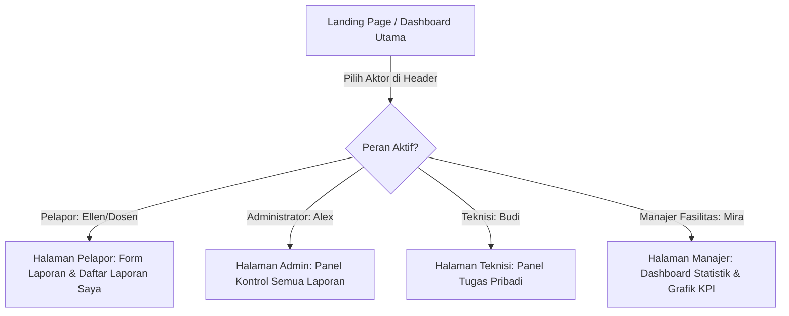

# UI Navigation Flow Design: Campus Service Request and Maintenance System

Dokumen ini menjelaskan alur navigasi dan perpindahan halaman (*UI Flow*) untuk 4 aktor utama berdasarkan peran yang sedang aktif disimulasikan.

---

## 1. Alur Utama Navigasi Peran (Global Role Switcher)
Aplikasi menggunakan mekanisme *Header Switcher* untuk mensimulasikan login multi-aktor. Alur utamanya dirancang sebagai berikut:

---

## 2. Alur Halaman Per Aktor (Actor Flow Details)

### A. Alur Pelapor (Reporter Workflow)
1.  **Halaman Utama Pelapor**:
    *   Formulir untuk membuat laporan baru (mengisi Judul, Deskripsi, Lokasi, Kategori).
    *   Tabel daftar laporan kerusakan milik dirinya sendiri.
2.  **Aksi Pembuatan**: Isi Form ➔ Klik "Kirim Laporan" ➔ Validasi Backend ➔ Laporan tersimpan ➔ Halaman memuat ulang daftar laporan otomatis.
3.  **Halaman Detail Laporan**: Klik salah satu baris laporan di tabel ➔ Masuk ke halaman detail.
    *   Menampilkan rincian data laporan, alur log status (timeline), dan kolom komentar.
    *   Jika status laporan `RESOLVED` ➔ Tombol aksi **"Konfirmasi Selesai"** (ubah status ke `CLOSED`) dan **"Laporkan Belum Tuntas"** (ubah status kembali ke `ASSIGNED`) ditampilkan.

### B. Alur Administrator (Administrator Workflow)
1.  **Halaman Utama Admin (Panel Kontrol)**:
    *   Tabel berisi seluruh laporan masuk di sistem.
    *   Fitur filter status dan kolom pencarian kata kunci.
2.  **Halaman Detail Laporan (Triage & Assignment)**: Klik baris laporan ➔ Masuk ke detail.
    *   Tersedia dropdown mengubah **Kategori** (jika pelapor salah pilih).
    *   Tersedia dropdown memilih **Tingkat Prioritas** (`LOW`, `MEDIUM`, `HIGH`).
    *   Tersedia dropdown memilih **Teknisi** yang akan ditugaskan. Setelah dikonfirmasi, status berubah menjadi `ASSIGNED`.
    *   Tersedia opsi membatalkan laporan (`CANCELLED`) atau menutup laporan (`CLOSED`).

### C. Alur Teknisi (Technician Workflow)
1.  **Halaman Utama Teknisi (Daftar Tugas)**:
    *   Hanya menampilkan laporan yang ditugaskan kepada Teknisi bersangkutan.
    *   Diurutkan berdasarkan prioritas `HIGH` di posisi teratas.
2.  **Halaman Detail Tugas**: Klik tugas ➔ Masuk ke detail.
    *   Jika status `ASSIGNED` ➔ Tombol aksi **"Mulai Mengerjakan"** (mengubah status ke `IN PROGRESS`).
    *   Jika status `IN PROGRESS` ➔ Tombol aksi **"Tandai Selesai"** (mengubah status ke `RESOLVED`).
    *   Dapat menambahkan komentar untuk koordinasi kendala teknis lapangan.

### D. Alur Manajer Fasilitas (Manager Workflow)
1.  **Halaman Utama Manajer**:
    *   Menampilkan ringkasan kartu KPI (Total Laporan, Laporan Aktif, Laporan Selesai, Waktu Respon Rata-rata).
    *   Grafik pie/bar untuk melihat persentase kerusakan berdasarkan kategori.
    *   Daftar laporan aktif diurutkan berdasarkan prioritas.
2.  **Halaman Detail (Read-Only)**: Manajer dapat mengklik laporan untuk membaca deskripsi lengkap, log status, dan komentar koordinasi, namun seluruh elemen input/dropdown dinonaktifkan (bersifat read-only).
